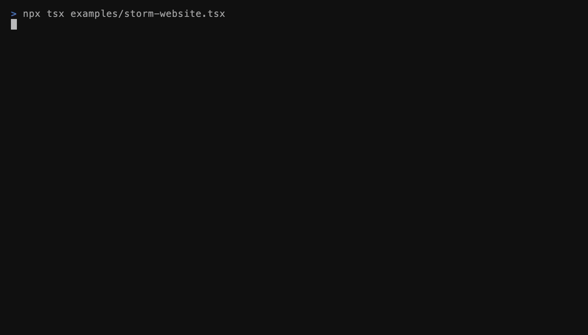
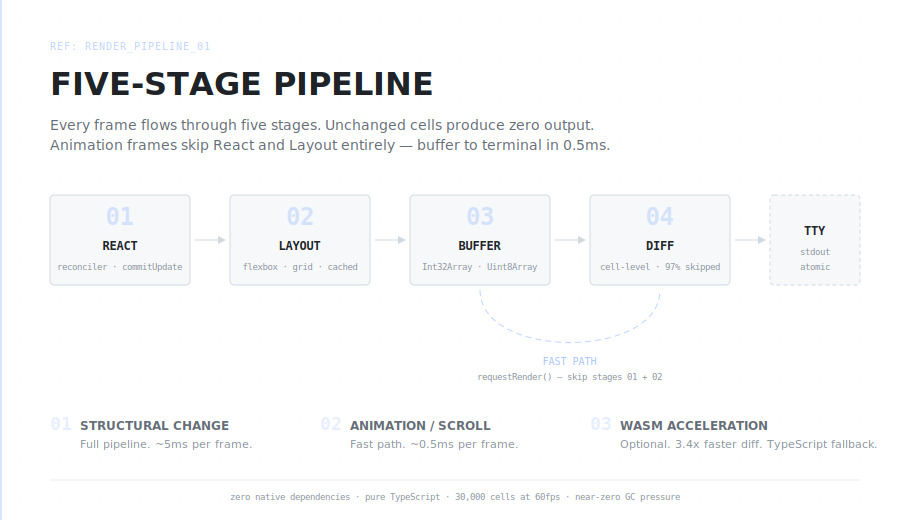
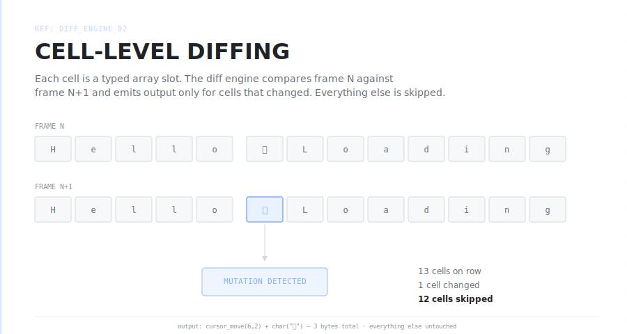
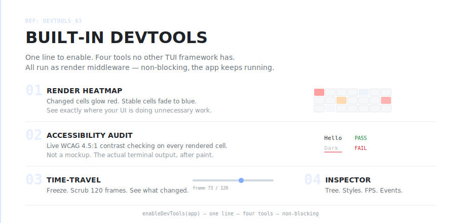

<h1 align="center">
  <picture>
    <source media="(prefers-color-scheme: dark)" srcset="assets/logo-white.png">
    <source media="(prefers-color-scheme: light)" srcset="assets/logo-black.png">
    
  </picture>
  &nbsp;storm
</h1>

<p align="center">
  The terminal deserves a real UI framework.<br>
  92 components. Cell-level rendering. Sub-millisecond frames. Zero native deps.
</p>

<p align="center">
  
  
  
  
  
</p>

<br>

<p align="center">
  
</p>

<br>

## What is Storm

> **A compositor-based terminal UI framework.** Fast. Layered. Unstoppable.

Storm treats your terminal like a display server — not a string printer.

| | |
|---|---|
| **Rendering** | Cell-level diff. Typed-array buffer. 97% of cells skipped per frame. |
| **Layout** | Pure-TS flexbox + CSS Grid. No native dependencies. |
| **Speed** | Dual-speed: React for structure, `requestRender()` for 60fps animation. |
| **DevTools** | Time-travel debugging. Render heatmaps. Accessibility audit. |
| **SSH** | Serve your app over SSH with built-in auth and rate limiting. |

### By the numbers

| 92 components | 19 AI widgets | 82 hooks | 15 headless behaviors | 12 themes |
|:---:|:---:|:---:|:---:|:---:|
| Input, Data, Layout, Viz, Feedback, Nav | OperationTree, MessageBubble, StreamingText... | useTick, useBuffer, useFocus, useScroll... | useSelectBehavior, useTreeBehavior... | Arctic, Midnight, Neon, Calm... |

Plus: `.storm.css` hot-reload. Plugin system with async setup + scoping. i18n. Declarative animations. Buffer-level backgrounds. Online playground.

<br>

## Get started in 5 minutes

Requires Node.js 20+ and React 18 or 19.

```bash
npm install @orchetron/storm-tui react
```

**Step 1** — Your first Storm app:

```tsx
import { render, Box, Text, Spinner, useInput, useTui } from "@orchetron/storm-tui";

function App() {
  const { exit } = useTui();
  useInput((e) => { if (e.key === "c" && e.ctrl) exit(); });

  return (
    <Box padding={1}>
      <Spinner type="diamond" color="#82AAFF" />
      <Text bold color="#82AAFF"> storm is alive</Text>
    </Box>
  );
}

render(<App />).waitUntilExit();
```

**Step 2** — Add scrollable content:

```tsx
import { render, Box, Text, ScrollView, useInput, useTui, useTerminal } from "@orchetron/storm-tui";
import { useState } from "react";

function App() {
  const { width, height } = useTerminal();
  const { exit } = useTui();
  const [messages] = useState(["Scanning codebase...", "Found 3 issues", "Generating patch"]);
  useInput((e) => { if (e.key === "c" && e.ctrl) exit(); });

  return (
    <Box flexDirection="column" width={width} height={height}>
      <ScrollView flex={1} stickToBottom>
        {messages.map((msg, i) => <Text key={i}>{msg}</Text>)}
      </ScrollView>
    </Box>
  );
}

render(<App />).waitUntilExit();
```

**Step 3** — Add AI agent widgets:

```tsx
import { render, Box, MessageBubble, OperationTree, ApprovalPrompt, useTerminal, useTui, useInput } from "@orchetron/storm-tui";

function App() {
  const { width, height } = useTerminal();
  const { exit } = useTui();
  useInput((e) => { if (e.key === "c" && e.ctrl) exit(); });

  return (
    <Box flexDirection="column" width={width} height={height}>
      <MessageBubble role="assistant">I'll fix the bug in auth.ts.</MessageBubble>

      <OperationTree nodes={[
        { id: "1", label: "Reading auth.ts", status: "completed", durationMs: 120 },
        { id: "2", label: "Editing code", status: "running" },
        { id: "3", label: "Running tests", status: "pending" },
      ]} />

      <ApprovalPrompt tool="writeFile" risk="medium" params={{ path: "auth.ts" }} onSelect={() => {}} />
    </Box>
  );
}

render(<App />).waitUntilExit();
```

> You just went from zero to an AI agent interface. Every example is copy-paste runnable. The OperationTree spinner animates at 80ms through imperative cell mutation — no React state churn, no layout rebuild.

<br>

## How it renders

<p align="center">
  
</p>

<p align="center">
  
</p>

On a typical scroll frame, **97% of cells are unchanged**. Storm skips them entirely. The typed-array buffer eliminates ~30,000 Cell objects per frame, reducing GC pressure by ~90%.

- **Cell-level diff** — only changed cells are written (not full lines like Ink)
- **DECSTBM hardware scroll** — terminal-native scroll regions for pure scroll ops
- **Optional WASM acceleration** — 33KB Rust module for 3.4× faster scroll rendering
- **Correct grapheme rendering** — `Intl.Segmenter` for ZWJ emoji (👨‍👩‍👧‍👦 = 2 columns, not 8). First TUI framework to handle this correctly.
- **Sub-millisecond frame times** at 60fps

<br>

## DevTools

<p align="center">
  
</p>

```tsx
import { enableDevTools } from "@orchetron/storm-tui";

const app = render(<App />);
enableDevTools(app);  // press 1/2/3/4
```

<br>

## What's included

| | | |
|:--|:--|:--|
| **92 Components** | Box, Text, ScrollView, Tabs, Modal, Table, DataGrid, Tree, Form, Select, Spinner (14 types), DiffView, Calendar, and 79 more | [Browse all →](docs/components.md) |
| **19 AI Widgets** | OperationTree, MessageBubble, ApprovalPrompt, StreamingText, SyntaxHighlight, MarkdownText, TokenStream, ContextWindow, CostTracker, ModelBadge | [Browse all →](docs/widgets.md) |
| **74 Hooks** | 4 tiers — Essential, Common, Interactive, and 15 Headless behavior hooks for building custom components from scratch | [Decision matrix →](docs/hook-guide.md) |
| **11 Themes** | Arctic, Midnight, Ember, Voltage, Dusk, Horizon, Neon, High Contrast + personality system + live `.storm.css` hot-reload | [Theming guide →](docs/theming.md) |
| **Animations** | `<Transition>` for enter/exit, `<AnimatePresence>` for mount/unmount, `useTween` for easing, spring physics | [Animation guide →](docs/animations.md) |
| **i18n** | Locales, RTL, pluralization rules for English, French, Arabic, Russian, Japanese | [i18n guide →](docs/i18n.md) |
| **5 Plugins** | Vim mode, compact mode, auto-scroll (gg/G), screenshot (Ctrl+Shift+S), status bar | [Plugin guide →](docs/plugins.md) |

> All components are `React.memo`'d, plugin-interceptable, and ship with ARIA roles.

<br>

## Quick start (scaffold)

```bash
npx create-storm-app my-app
cd my-app && npm install && npm run dev
```

Generates a working project with TypeScript, hot reload, and a starter template.

## Try it

```bash
npx tsx examples/storm-code/index.tsx    # AI coding agent — press t for light/dark
npx tsx examples/storm-ops/index.tsx     # Operations dashboard
npx tsx examples/devtools-demo.tsx       # DevTools showcase
npx tsx examples/run-showcase.ts ai      # Widget gallery
```

## Docs

| | |
|:--|:--|
| [Getting Started](docs/getting-started.md) | First app in 5 minutes |
| [Components](docs/components.md) | All 92 with props and examples |
| [AI Widgets](docs/widgets.md) | 19 agent-specific widgets |
| [Hook Guide](docs/hook-guide.md) | 74 hooks, 4 tiers, decision matrix |
| [Recipes](docs/recipes.md) | 11 copy-paste patterns |
| [Common Pitfalls](docs/pitfalls.md) | Top 13 mistakes to avoid |
| [Theming](docs/theming.md) | 11 themes, personality, live stylesheets |
| [DevTools](docs/devtools.md) | Heatmap, audit, time-travel, inspector |
| [Animations](docs/animations.md) | Transition, AnimatePresence, easing |
| [Plugins](docs/plugins.md) | Lifecycle, input, custom elements |
| [i18n](docs/i18n.md) | Locales, pluralization, RTL |
| [Performance](docs/performance.md) | Architecture deep-dive |

## Contributing

[CONTRIBUTING.md](./CONTRIBUTING.md)

## License

MIT

---

<p align="center">
  ⚡ Crafted with obsession by <b>Orchetron</b>
</p>
